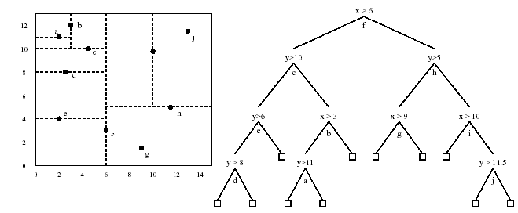

# A Comparison of Spatial Search Using K-D Trees And Quadtrees
>  This project compares and analyzes the performance of two popular spatial indexing data structures: K-D Trees and Quadtrees for insertion, search and finding the nearest neighbors of points on a 2D plane.

## Table of contents
* [General Information](#general-information)
* [Design Choices](#design-choices)
* [Comparative Analysis](#comparative-analysis)
* [Conclusion](#conclusion)
* [Contact](#contact)

## General Information

The utilization of spatial data in modern Geographical Information Systems and Image Processing has led to increased research towards efficient spatial search techniques. For finding nearest neighbors of a given point with millions of points in the data set, the conventional queries are too slow to use in practice. K-D Trees and Quadtrees are two efficient data structures for spatial search implementations which support faster organization and processing of spatial data points.

### QuadTree
Each Quadtree node has at most four children. The children nodes can be visualized as four quadrants of a 2-dimensional plane. The data points are organized by recursively subdividing the nodes into four quadrants and associating the data with leaf nodes. The subdivided areas can be squares or rectangles depending upon the division.

Some applications of Quadtrees include:
* Computer vision, CAD, street maps (Google Maps / Google Earth).
* Virtual reality
* Computer graphics, games, movies
* Image Compression

#### Construction:
To construct a Quadtree from a 2-D space:
* Split the 2-D plane into quadrants.
* If a quadrant contains one or more points in it, create a child node.
* If a quadrant does not contain any points, do not create child nodes.
* Recursively follow the steps for each children.

Figure 1: Quadtree for a set of 6 points.
#### Insertion:
To insert a given point into the Quadtree, we first check whether the point is within the bounds of the Quadtree window. If not, we cease the insertion. If the point lies within the window boundaries, we create the appropriate child to contain this element.

#### Search:
To search a given point in the Quadtree, the children are recursed until the leaf containing the point is obtained. For every recursion, the search space gets reduced by one-fourth since only the quadrant containing the point is selected.

#### Nearest Neighbor:
To search for the nearest neighbor Q we choose a point to search and a 2-dimensional window W around this point in which we expect to find its nearest neighbor. Then, the following steps are performed:
* Put the root on a stack
* Repeat
 &nbsp;&nbsp;Pop the next node T from the stack
 &nbsp;&nbsp;For each child C of T
 &nbsp;&nbsp;&nbsp;&nbsp;If C intersects with W around Q, add C to the stack
 &nbsp;&nbsp;&nbsp;&nbsp;If C is a leaf, examine point(s) inside C and record the minimum Euclidean distance to Q.
* Return Q

### KD-Tree
The idea for constructing a KD-Tree (also known as K-Dimensional Tree) is that each level of the tree compares against one dimension. KD-Tree can be visualized as a binary tree in which every node is a k-dimensional point.

Some applications of KD-Trees include:
* Multidimensional search key (range searches and nearest neighbor searches).
* Image Compression.

#### Construction and Insertion:
Each depth level of the tree is associated with a dimension. For each data point insertion, at every level until the insertion location is found, the node is compared with the data point with respect to the dimension of each depth level. If the comparison results in a lower value, the left tree is considered otherwise the right tree is considered.

To insert a point P(x,y) in the tree with dimension = 2, below steps are followed:
* A depth level is x-Aligned if for the given depth level, x coordinates are taken into consideration.
* Similarly, a depth level is y-Aligned if for the given depth level, y coordinates are taken into consideration.
* For each level, check if the current node is x-Aligned or y-Aligned.
* If the current node (a,b) is x-Aligned, compare x with a. If x>=a, P needs to be inserted to the right subtree otherwise left subtree.
* If the current node (a,b) is y-Aligned, compare y with b. If y>=b, P needs to be inserted to the right subtree otherwise left subtree.
* Recurse until a node with null value is obtained. Insert P there.

Figure 2: KD-Tree Implementation.

#### Search:
Searching a point P (x,y)  in a KD Tree with dimension = 2 involves the following steps:
* For each level, check if the current node is x-Aligned or y-Aligned.
* If the current node (a,b) is x-Aligned, compare x with a. If x>=a, search for P in the right subtree otherwise left subtree.
* If the current node (a,b) is y-Aligned, compare y with b. If y>=b, search for P in the right subtree otherwise left subtree.
* Recurse until P is obtained. If the current node can not be traversed further and P is not found, report search unsuccessful.

#### Nearest Neighbor:
To find the nearest neighbor:
* Search from the root node downwards and at each level compare which of the two children nodes have the lesser Euclidian distance with the point for which the nearest neighbour has to be found.
* Choose the node with the lesser Euclidian distance to traverse next.
* Keep going downwards while maintaining the minimum Euclidian distance found till now and output the node which was the closest when a leaf node is reached.

## Design Choices:
* The dimension of KD-Tree is kept as 2 since the spatial search is implemented in a 2 dimension plane.
* Similarly, the Quadtree constructed is a D2 granular Quadtree. Here D2 means a tree with dimension 2 and granular is the nature in which points are stored in the nodes. The minimum division for the quadtree possible is of area 1 square unit. Hence, there can not be more than one data point present within a granule/ area of 1 square unit.
* The coordinates of 2-dimensional plane window W over which spatial search implementations are compared are kept as (0,0) and (100000,100000).
* Points to be inserted are selected from the same window W.
* The data points selected for insertion are generated randomly. For comparative analysis of insertion, the number of data points are varied from 1000 to 100,000 in multiples of 10,000.
* For comparative analysis of the search operation, the number of test cases to be searched for each N (Here N is the number of data points in the data structure) is varied from 1 to 1000.
* The density value ranges from 0 to 10 and is being used to segregate points into two regions: one of a high density cluster which occupies 10% of the 2-D plane and the other set will be randomly placed. As the density increases from 0 - 10, the proportion of points allotted to the dense cluster is higher. For eg: At density 0, all points are randomly placed on the 2D plane. At density 1, 10% of the points are in the dense cluster and 90% are random and so on.
* To find the nearest neighbor, a window R of area W/10 is created. Nearest neighbor Q is calculated for a point P where P and Q both lie in R. Hence, it is guaranteed that the nearest neighbor is present in R and thus the search is restricted to window R.

## Comparative Analysis:
We compare spatial search implementations based on the following factors:
* Insertion
	 a. Comparison based on number of data points
	 b. Comparison based on varying the distribution density of points (Evenly spread data v/s Densely populated data) and relative distance.
* Search
	 a. Comparison based on number of data points
	 b. Comparison based on varying the distribution density of points (Evenly spread data v/s Densely populated data) and relative distance.

* Finding the nearest neighbor
	 a. Comparison based on number of data points averaged over multiple density of data points.

### Insertion
#### a. Comparison based on number of data points:

To insert an element in a Quadtree, the average case time complexity is O(Logd(N)) where N is size of distance. Here, d=4 since the branching factor is 4.

Similarly, the insertion time complexity for KD Trees is O(Logd(N)) with d=2, since the branching factor is 2.

This is because in Quadtrees, the data reaching a node is split into a fixed (2^d), equal size cells, in our case: 4, whereas in KD-Trees, the data is split into two regions based on the current depth level dimension.

The graph represents the time taken to construct a Quadtree and KD-Tree for n elements. In theory, worst case construction time for a Quadtree and KD-Tree is O(nLogn) but the average time comes out to be O(N). In practice, the construction time is between O(N) and O(NlogN) because some data points result in a skewed insertion.

Our approach to insert a value in the quad tree is granular. It means that in order to insert a value in quadtree, the child nodes are recursively iterated until the exact granular location is obtained and then the point is inserted. Hence, construction of quad tree requires a traversal of greater depth per insertion than KD trees. Thus, in practice, construction of quad trees takes more time than KD-Trees.

#### b. Comparison based on varying the distribution density of points(Evenly spread data v/s Densely populated data) and relative distance:

As the density of data points for a specific region within the 2D plane increases, the probability of inserting a data point within the same child nodes increase and hence fewer number of new child nodes are created. This explains a decrease in the average time of construction and insertion for both the trees.

### Search
#### a. Comparison based on number of data points:

We notice that quad trees are much faster than KD-trees in searching as data size increases. This result is consistent with the fact that KD-trees take log2(N) time on average to search a point and Quad trees take log4(N) on average.

#### b. Comparison based on varying the distribution density of points (Evenly spread data v/s Densely populated data) and relative distance:

As the density increases, we create points that are closer to each other. Higher the density, higher the proportion of points that lie in a small area in the graph.

When the distribution of points is scattered randomly, the average time taken to search a point P is lesser in Quadtrees when compared with KD-Trees. This is because in quadtrees, the data reaching a node is split into a fixed (2^d), equal size cells, in our case: 4, whereas in kdtrees, the data is split into two regions based on the current depth level dimension. In lesser density 2D plane, since the time complexity depends on the depth of tree and the branching factor for Quadtree is high which results in reduced depth, it performs better than a KD-Tree of equal dimension. Quadtrees do not scale well to high dimensions, due to the exponential dependency in the dimension.

As the density of data points increases in a region, the relative performance of quad trees remains better than KD- trees excluding some exceptions when the quad tree is skewed resulting in time complexity averaging to O(n).

### Nearest Neighbor

KD tree is very efficient in finding nearest neighbor because it can reliably locate neighbors in average log(N) time given that the KD tree is not skewed very badly. The graph will not represent an exact log graph because the points are generated randomly on the plane and since KD tree is not self balancing, some data point neighbors will be found faster than others.

Analysis of Quad tree nearest neighbor is a little bit trickier because of the window size we have to choose to search neighbors in. A large window size will result in more Quadtree nodes being considered as neighbors to expand and explore for finding neighbors.  For this graph we chose window size to be 1/100 of the size of the entire 2D plane on which the quad tree was defined. Since quad trees are not optimized to search nearest neighbors like KD-trees, we experience longer times to calculate nearest neighbors of the same points.

## Conclusion
From the analysis, we conclude that for spatial indexing applications where the data points change frequently and/or frequent rebuilding of the data structure is required, KD Trees perform better than Quad Trees. This is because the construction time of KD Trees is better than Quad trees with same dimension. The space required by both the data structures is O(N).

In applications where the data structure is built once and searching is the more frequent operation, Quad trees are a better choice irrespective of the relative distance of the points under consideration and the density variation of inserted data points.
In finding the nearest neighbor, KD-Trees perform better with an average time complexity of O(log(N)) and a worst case O(N).

## Contact
Created by [@AmayKadre](http://linkedin.com/in/amaykadre/) and Sagar Alavandar.
